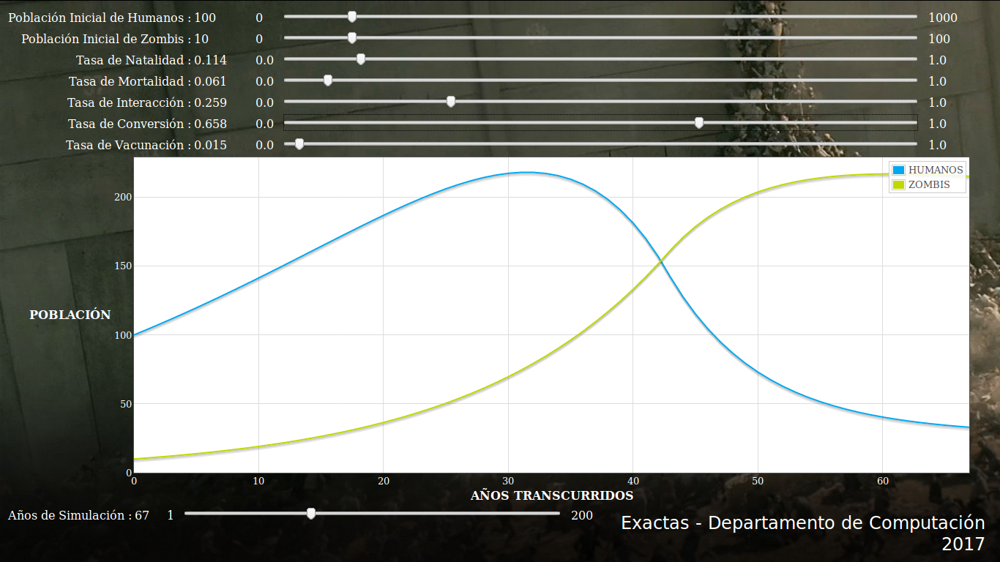

Stand Apocalipsis Zombi
===

Instrucciones para ejecutar el stand:
---
 * (opcional) modificar la variable EVENT (en event.js) según el evento actual.
 * Abrir s1.html en un navegador web.
 * Abrir s2.html en un navegador web.
 * Abrir la carpeta "resultados" en un navegador de archivos.

Requiere (S1):
---
 * Navegador web Chromium (ver si es lo mismo en Chrome) en Ubuntu. En Firefox también anda pero no me gusta el modo fullscreen de Firefox.

Requiere (S2):
---
 * Navegador web Firefox en Ubuntu. Chromium no funciona.
 * No hace falta conexión a internet.
 * Reproductor de video (VLC funciona. El programa por defecto de Ubuntu también, aunque no es tan lindo).
  - Configurarlo para que loopée.

Instrucciones de uso (S1):
---
 * Mover los sliders de cada parámetro para ver cómo se modifican las curvas de crecimiento poblacional.

Instrucciones de uso (S2):
---
 * Una vez elegido el mapa, hacer click para posicionar un zombi en el espacio. La simulación inicia automáticamente.
 * Los parámetros  y  pueden modificarse arrastrando el slider correspondiente en la pantalla.
 * La simulación se puede pausar con 'P' o haciendo click en 'Pause'.
 * La simulación se puede reiniciar con 'Q' o haciendo click en 'Reset'.
 * Para las explicaciones, utilizar las imágenes y los videos en la carpeta "resultados".

Links:
---
 * [Repositorio](https://git.exactas.uba.ar/extension-dc/stand-zombis/)
 * [Repositorio de la versión original de S2](https://github.com/mattbierbaum/zombies-usa/)
 * [Demo online de la versión original de S2](http://mattbierbaum.github.io/zombies-usa/)

Cosas para mejorar:
---
 * Ejecutarlo en modo Kiosko (Firefox) o hacer que ande en Chrome.
 * Conseguir el libro impreso.
 * Agregar el link al libro en la sección "Links" de este archivo.

FAQ:
---
  * ¿Esto se usa en la vida real?
   * Sí.
 * ¿En serio?
   * Sí.
 * ¿En la vida real?
   * Sí.
